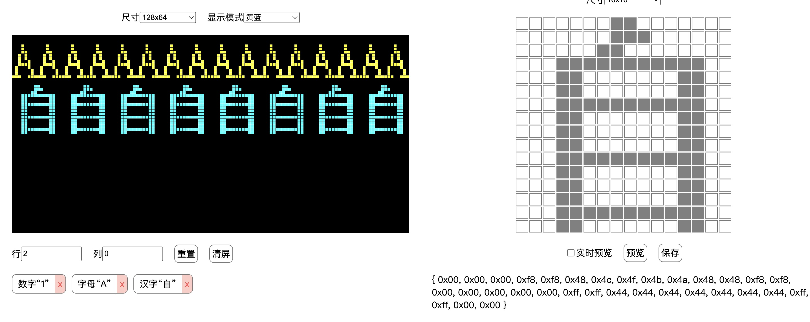

# 12864-character-builder

一个使用Vue3开发的可用于生成16x16或是8x8字形的工具，用于SSD1306控制12864 oled 屏幕的的显示输出。

- [x] 支持 128x64、128x32 两种尺寸屏幕的模拟预览
- [x] 支持白色、蓝色、黄蓝双色屏幕的效果预览
- [x] 支持 16x16、8x16、8x8 的不同尺寸的字模编辑与预览
- [x] 支持在浏览器 `localStorage` 中保存设计内容

